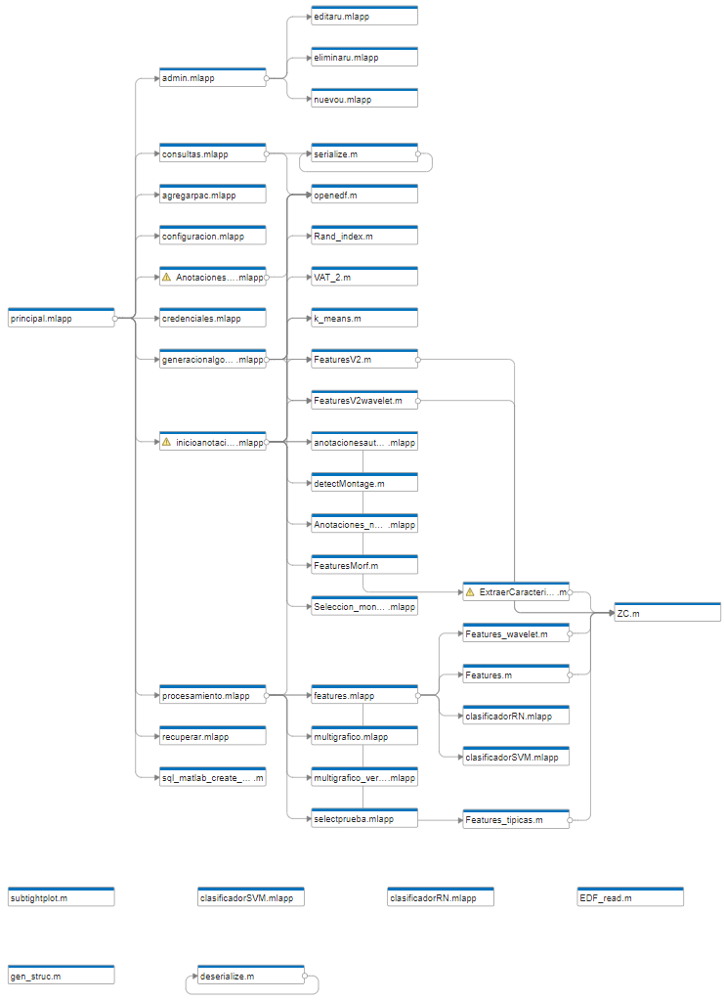

<!-- Código generado automáticamente con ayuda de Dependency Analyzer de MATLAB -->

<h2 style="margin-left:20px;margin-right:20px;margin-top:20px;margin-bottom:20px;">Productos de MATLAB</h2><ul style="margin-left:20px;margin-right:20px;margin-top:20px;margin-bottom:20px;">

<li>MATLAB.<li>Bioinformatics Toolbox.</li><li>Database Toolbox.</li><li>Deep Learning Toolbox.</li><li>Fuzzy Logic Toolbox.</li></li><li>Parallel Computing Toolbox</li><li>Signal Processing Toolbox.</li><li>Statistics and Machine Learning Toolbox.</li><li>Wavelet Toolbox.</li></ul>

<h2 style="margin-left:20px;margin-right:20px;margin-top:20px;margin-bottom:20px;">Add-Ons</h2>
<ul style="margin-left:20px;margin-right:20px;margin-top:20px;margin-bottom:20px;"><li>Widgets Toolbox - MATLAB App Designer Components 2.3.1.</li></ul>

<h2 style="margin-left:20px;margin-right:20px;margin-top:20px;margin-bottom:20px;">Archivos de Herramienta</h2>

<table style="border-collapse:collapse;border-spacing:0;table-layout: fixed; width: 470px" class="tg"><colgroup><col style="width: 243px"><col style="width: 227px"></colgroup>
<thead><tr><th style="background-color:#000000;border-color:#ffffff;border-style:solid;border-width:1px;color:#ffffff;font-family:Arial, sans-serif;font-size:14px;font-weight:normal;overflow:hidden;padding:10px 5px;text-align:left;vertical-align:middle;word-break:normal">admin.mlapp</th><th style="background-color:#000000;border-color:#ffffff;border-style:solid;border-width:1px;color:#ffffff;font-family:Arial, sans-serif;font-size:14px;font-weight:normal;overflow:hidden;padding:10px 5px;text-align:left;vertical-align:middle;word-break:normal">ExtraerCaracteristicas.m</th></tr></thead>
<tbody><tr><td style="background-color:#000000;border-color:#ffffff;border-style:solid;border-width:1px;color:#ffffff;font-family:Arial, sans-serif;font-size:14px;overflow:hidden;padding:10px 5px;text-align:left;vertical-align:middle;word-break:normal">agregarpac.mlapp</td><td style="background-color:#000000;border-color:#ffffff;border-style:solid;border-width:1px;color:#ffffff;font-family:Arial, sans-serif;font-size:14px;overflow:hidden;padding:10px 5px;text-align:left;vertical-align:middle;word-break:normal">Features.m</td></tr>
<tr><td style="background-color:#000000;border-color:#ffffff;border-style:solid;border-width:1px;color:#ffffff;font-family:Arial, sans-serif;font-size:14px;overflow:hidden;padding:10px 5px;text-align:left;vertical-align:middle;word-break:normal">anotacionesautomaticas.mlapp</td><td style="background-color:#000000;border-color:#ffffff;border-style:solid;border-width:1px;color:#ffffff;font-family:Arial, sans-serif;font-size:14px;overflow:hidden;padding:10px 5px;text-align:left;vertical-align:middle;word-break:normal">Features_tipicas.m</td></tr>
<tr><td style="background-color:#000000;border-color:#ffffff;border-style:solid;border-width:1px;color:#ffffff;font-family:Arial, sans-serif;font-size:14px;overflow:hidden;padding:10px 5px;text-align:left;vertical-align:middle;word-break:normal">AnotacionesFlexibles.mlapp</td><td style="background-color:#000000;border-color:#ffffff;border-style:solid;border-width:1px;color:#ffffff;font-family:Arial, sans-serif;font-size:14px;overflow:hidden;padding:10px 5px;text-align:left;vertical-align:middle;word-break:normal">Features_wavelet.m</td></tr>
<tr><td style="background-color:#000000;border-color:#ffffff;border-style:solid;border-width:1px;color:#ffffff;font-family:Arial, sans-serif;font-size:14px;overflow:hidden;padding:10px 5px;text-align:left;vertical-align:middle;word-break:normal">Anotaciones_no_supervisado.mlapp</td><td style="background-color:#000000;border-color:#ffffff;border-style:solid;border-width:1px;color:#ffffff;font-family:Arial, sans-serif;font-size:14px;overflow:hidden;padding:10px 5px;text-align:left;vertical-align:middle;word-break:normal">fetch</td></tr>
<tr><td style="background-color:#000000;border-color:#ffffff;border-style:solid;border-width:1px;color:#ffffff;font-family:Arial, sans-serif;font-size:14px;overflow:hidden;padding:10px 5px;text-align:left;vertical-align:middle;word-break:normal">AplicarMontajeButtonPushed</td><td style="background-color:#000000;border-color:#ffffff;border-style:solid;border-width:1px;color:#ffffff;font-family:Arial, sans-serif;font-size:14px;overflow:hidden;padding:10px 5px;text-align:left;vertical-align:middle;word-break:normal">generacionalgoritmo.mlapp</td></tr>
<tr><td style="background-color:#000000;border-color:#ffffff;border-style:solid;border-width:1px;color:#ffffff;font-family:Arial, sans-serif;font-size:14px;overflow:hidden;padding:10px 5px;text-align:left;vertical-align:middle;word-break:normal">archivo.bin</td><td style="background-color:#000000;border-color:#ffffff;border-style:solid;border-width:1px;color:#ffffff;font-family:Arial, sans-serif;font-size:14px;overflow:hidden;padding:10px 5px;text-align:left;vertical-align:middle;word-break:normal">gen_struc.m</td></tr>
<tr><td style="background-color:#000000;border-color:#ffffff;border-style:solid;border-width:1px;color:#ffffff;font-family:Arial, sans-serif;font-size:14px;overflow:hidden;padding:10px 5px;text-align:left;vertical-align:middle;word-break:normal">binary_seq_to_string</td><td style="background-color:#000000;border-color:#ffffff;border-style:solid;border-width:1px;color:#ffffff;font-family:Arial, sans-serif;font-size:14px;overflow:hidden;padding:10px 5px;text-align:left;vertical-align:middle;word-break:normal">graficarfeatures</td></tr>
<tr><td style="background-color:#000000;border-color:#ffffff;border-style:solid;border-width:1px;color:#ffffff;font-family:Arial, sans-serif;font-size:14px;overflow:hidden;padding:10px 5px;text-align:left;vertical-align:middle;word-break:normal">calc_lz_complexity</td><td style="background-color:#000000;border-color:#ffffff;border-style:solid;border-width:1px;color:#ffffff;font-family:Arial, sans-serif;font-size:14px;overflow:hidden;padding:10px 5px;text-align:left;vertical-align:middle;word-break:normal">graficarfeatureswavelet</td></tr>
<tr><td style="background-color:#000000;border-color:#ffffff;border-style:solid;border-width:1px;color:#ffffff;font-family:Arial, sans-serif;font-size:14px;overflow:hidden;padding:10px 5px;text-align:left;vertical-align:middle;word-break:normal">clasificadorRN.mlapp</td><td style="background-color:#000000;border-color:#ffffff;border-style:solid;border-width:1px;color:#ffffff;font-family:Arial, sans-serif;font-size:14px;overflow:hidden;padding:10px 5px;text-align:left;vertical-align:middle;word-break:normal">inicioanotacionesauto.mlapp</td></tr>
<tr><td style="background-color:#000000;border-color:#ffffff;border-style:solid;border-width:1px;color:#ffffff;font-family:Arial, sans-serif;font-size:14px;overflow:hidden;padding:10px 5px;text-align:left;vertical-align:middle;word-break:normal">clasificadorSVM.mlapp</td><td style="background-color:#000000;border-color:#ffffff;border-style:solid;border-width:1px;color:#ffffff;font-family:Arial, sans-serif;font-size:14px;overflow:hidden;padding:10px 5px;text-align:left;vertical-align:middle;word-break:normal">k_means.m</td></tr>
<tr><td style="background-color:#000000;border-color:#ffffff;border-style:solid;border-width:1px;color:#ffffff;font-family:Arial, sans-serif;font-size:14px;overflow:hidden;padding:10px 5px;text-align:left;vertical-align:middle;word-break:normal">configuracion.mlapp</td><td style="background-color:#000000;border-color:#ffffff;border-style:solid;border-width:1px;color:#ffffff;font-family:Arial, sans-serif;font-size:14px;overflow:hidden;padding:10px 5px;text-align:left;vertical-align:middle;word-break:normal">multigrafico.mlapp</td></tr>
<tr><td style="background-color:#000000;border-color:#ffffff;border-style:solid;border-width:1px;color:#ffffff;font-family:Arial, sans-serif;font-size:14px;overflow:hidden;padding:10px 5px;text-align:left;vertical-align:middle;word-break:normal">consultas.mlapp</td><td style="background-color:#000000;border-color:#ffffff;border-style:solid;border-width:1px;color:#ffffff;font-family:Arial, sans-serif;font-size:14px;overflow:hidden;padding:10px 5px;text-align:left;vertical-align:middle;word-break:normal">multigrafico_vertical.mlapp</td></tr>
<tr><td style="background-color:#000000;border-color:#ffffff;border-style:solid;border-width:1px;color:#ffffff;font-family:Arial, sans-serif;font-size:14px;overflow:hidden;padding:10px 5px;text-align:left;vertical-align:middle;word-break:normal">credenciales.mlapp</td><td style="background-color:#000000;border-color:#ffffff;border-style:solid;border-width:1px;color:#ffffff;font-family:Arial, sans-serif;font-size:14px;overflow:hidden;padding:10px 5px;text-align:left;vertical-align:middle;word-break:normal">nuevou.mlapp</td></tr>
<tr><td style="background-color:#000000;border-color:#ffffff;border-style:solid;border-width:1px;color:#ffffff;font-family:Arial, sans-serif;font-size:14px;overflow:hidden;padding:10px 5px;text-align:left;vertical-align:middle;word-break:normal">deserialize.m</td><td style="background-color:#000000;border-color:#ffffff;border-style:solid;border-width:1px;color:#ffffff;font-family:Arial, sans-serif;font-size:14px;overflow:hidden;padding:10px 5px;text-align:left;vertical-align:middle;word-break:normal">openedf.m</td></tr>
<tr><td style="background-color:#000000;border-color:#ffffff;border-style:solid;border-width:1px;color:#ffffff;font-family:Arial, sans-serif;font-size:14px;overflow:hidden;padding:10px 5px;text-align:left;vertical-align:middle;word-break:normal">detectMontage.m</td><td style="background-color:#000000;border-color:#ffffff;border-style:solid;border-width:1px;color:#ffffff;font-family:Arial, sans-serif;font-size:14px;overflow:hidden;padding:10px 5px;text-align:left;vertical-align:middle;word-break:normal">principal.mlapp</td></tr>
<tr><td style="background-color:#000000;border-color:#ffffff;border-style:solid;border-width:1px;color:#ffffff;font-family:Arial, sans-serif;font-size:14px;overflow:hidden;padding:10px 5px;text-align:left;vertical-align:middle;word-break:normal">EDF_read.m</td><td style="background-color:#000000;border-color:#ffffff;border-style:solid;border-width:1px;color:#ffffff;font-family:Arial, sans-serif;font-size:14px;overflow:hidden;padding:10px 5px;text-align:left;vertical-align:middle;word-break:normal">procesamiento.mlapp</td></tr>
<tr><td style="background-color:#000000;border-color:#ffffff;border-style:solid;border-width:1px;color:#ffffff;font-family:Arial, sans-serif;font-size:14px;overflow:hidden;padding:10px 5px;text-align:left;vertical-align:middle;word-break:normal">editaru.mlapp</td><td style="background-color:#000000;border-color:#ffffff;border-style:solid;border-width:1px;color:#ffffff;font-family:Arial, sans-serif;font-size:14px;overflow:hidden;padding:10px 5px;text-align:left;vertical-align:middle;word-break:normal">Rand_index.m</td></tr>
<tr><td style="background-color:#000000;border-color:#ffffff;border-style:solid;border-width:1px;color:#ffffff;font-family:Arial, sans-serif;font-size:14px;overflow:hidden;padding:10px 5px;text-align:left;vertical-align:middle;word-break:normal">eliminaru.mlapp</td><td style="background-color:#000000;border-color:#ffffff;border-style:solid;border-width:1px;color:#ffffff;font-family:Arial, sans-serif;font-size:14px;overflow:hidden;padding:10px 5px;text-align:left;vertical-align:middle;word-break:normal">recuperar.mlapp</td></tr>
<tr><td style="background-color:#000000;border-color:#ffffff;border-style:solid;border-width:1px;color:#ffffff;font-family:Arial, sans-serif;font-size:14px;overflow:hidden;padding:10px 5px;text-align:left;vertical-align:middle;word-break:normal">FeaturesV2.m</td><td style="background-color:#000000;border-color:#ffffff;border-style:solid;border-width:1px;color:#ffffff;font-family:Arial, sans-serif;font-size:14px;overflow:hidden;padding:10px 5px;text-align:left;vertical-align:middle;word-break:normal">Seleccion_montaje.mlapp</td></tr>
<tr><td style="background-color:#000000;border-color:#ffffff;border-style:solid;border-width:1px;color:#ffffff;font-family:Arial, sans-serif;font-size:14px;overflow:hidden;padding:10px 5px;text-align:left;vertical-align:middle;word-break:normal">FeaturesMorf.m</td><td style="background-color:#000000;border-color:#ffffff;border-style:solid;border-width:1px;color:#ffffff;font-family:Arial, sans-serif;font-size:14px;overflow:hidden;padding:10px 5px;text-align:left;vertical-align:middle;word-break:normal">selectprueba.mlapp</td></tr>
<tr><td style="background-color:#000000;border-color:#ffffff;border-style:solid;border-width:1px;color:#ffffff;font-family:Arial, sans-serif;font-size:14px;overflow:hidden;padding:10px 5px;text-align:left;vertical-align:middle;word-break:normal">FeaturesV3frecuencia</td><td style="background-color:#000000;border-color:#ffffff;border-style:solid;border-width:1px;color:#ffffff;font-family:Arial, sans-serif;font-size:14px;overflow:hidden;padding:10px 5px;text-align:left;vertical-align:middle;word-break:normal">serialize.m</td></tr>
<tr><td style="background-color:#000000;border-color:#ffffff;border-style:solid;border-width:1px;color:#ffffff;font-family:Arial, sans-serif;font-size:14px;overflow:hidden;padding:10px 5px;text-align:left;vertical-align:middle;word-break:normal">FeaturesV2wavelet.m</td><td style="background-color:#000000;border-color:#ffffff;border-style:solid;border-width:1px;color:#ffffff;font-family:Arial, sans-serif;font-size:14px;overflow:hidden;padding:10px 5px;text-align:left;vertical-align:middle;word-break:normal">sqlwrite</td></tr>
<tr><td style="background-color:#000000;border-color:#ffffff;border-style:solid;border-width:1px;color:#ffffff;font-family:Arial, sans-serif;font-size:14px;overflow:hidden;padding:10px 5px;text-align:left;vertical-align:middle;word-break:normal">sql_matlab_create_consolidado.m</td><td style="background-color:#000000;border-color:#ffffff;border-style:solid;border-width:1px;color:#ffffff;font-family:Arial, sans-serif;font-size:14px;overflow:hidden;padding:10px 5px;text-align:left;vertical-align:middle;word-break:normal">subtightplot.m</td></tr>
<tr><td style="background-color:#000000;border-color:#ffffff;border-style:solid;border-width:1px;color:#ffffff;font-family:Arial, sans-serif;font-size:14px;overflow:hidden;padding:10px 5px;text-align:left;vertical-align:middle;word-break:normal">VAT</td><td style="background-color:#000000;border-color:#ffffff;border-style:solid;border-width:1px;color:#ffffff;font-family:Arial, sans-serif;font-size:14px;overflow:hidden;padding:10px 5px;text-align:left;vertical-align:middle;word-break:normal">VAT_2.m</td></tr>
<tr><td style="background-color:#000000;border-color:#ffffff;border-style:solid;border-width:1px;color:#ffffff;font-family:Arial, sans-serif;font-size:14px;overflow:hidden;padding:10px 5px;text-align:left;vertical-align:middle;word-break:normal">ZC.m</td><td style="background-color:#000000;border-color:#ffffff;border-style:solid;border-width:1px;color:#ffffff;font-family:Arial, sans-serif;font-size:14px;overflow:hidden;padding:10px 5px;text-align:left;vertical-align:middle;word-break:normal">clasificadorRN.mlapp</td></tr></tbody></table>

<h2 style="margin-left:20px;margin-right:20px;margin-top:20px;margin-bottom:20px;">Gráfico de Dependencias</h2>

