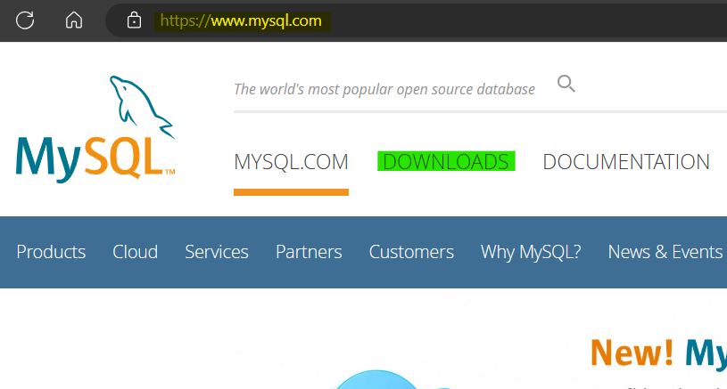
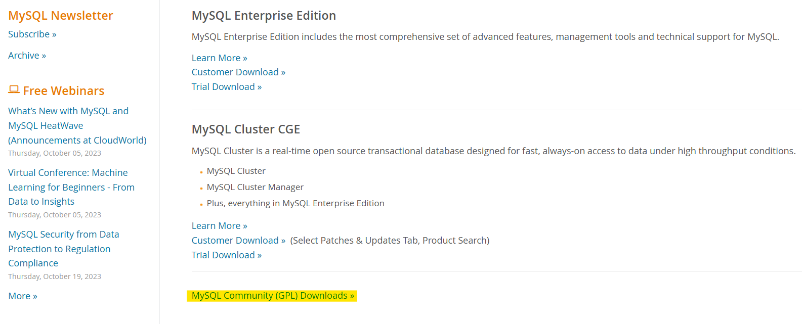
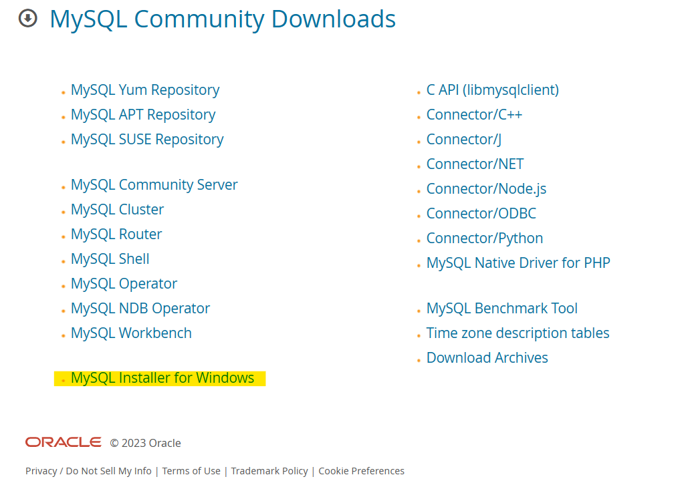
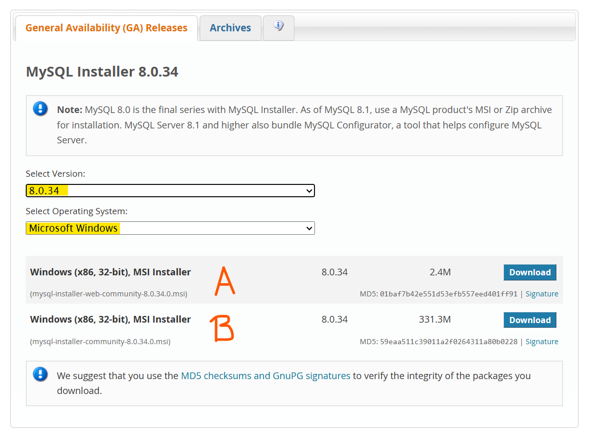
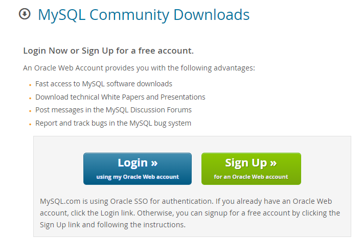
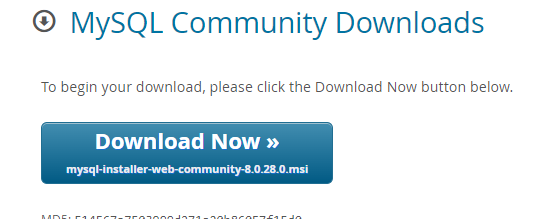

# Herramienta de Software con una Base de Datos Integrada para el Estudio de la Epilepsia - Fase III

## Manual de instalación

## Descarga de  MySQL

1. Ingresar a <https://www.mysql.com/>
2. Ingresar a Downloads\

3. Ingresar a "MySQL Community (GPL) Downloads"\

4. Ingresar a "MySQL Installer for Windows"\

5. Seleccione la  última version de MySQL 8.0.XX y luego verifique que se encuentre Windows seleccionado. Descargar la opción A si la maquina donde se instalará tiene acceso a internet y B si no tiene acceso a internet.\

6. Si no se cuenta con cuenta de oracle es necesario crear una, de lo contrario simplemente iniciar sesión.\

7. Descargar el instalador.\

## Instalación de MySQL

1. Ejecutar el instalador.
2. Seleccionar la instalación tipo "Custom".\

3. Seleccionar únicamente MySQL Server y el conector ODBC x64.\

4. Ejecutar la descarga. Obviar este paso, en caso de que se utiliza la versión sin internet (Opción B en la sección anterior).\

5. Al terminar la descara, ejecute la instalación.\

6. Continuar con el asistente de instalación hasta la pantalla de configuración inicial.\
\
7. Verificar que se cumplan las siguientes configuraciones.\

8. Ingresar una contraseña para el usuario "root" de la base de datos. Debe recordar esta contrseña, ya que se utilizara para crear el modelo relacional y es el único usuario con todos los permisos en la base de datos y en la aplicación EEG Analysis Toolbox.\

9. Verificar que se cumplan las siguientes configuraciones.\\

10. Verificar que se cumplan las siguientes configuraciones.\\

10. Ejecute la configuración, continuar con el asistente de instalación hasta la última pantalla y salir.\

### Configurar conexión ODBC a MySQL en Windows

1. Buscar en programas de Windows "ODBC". Abrir el programa "Origenes de datos ODBC..." o "ODBC Data Sources" si su sitema se encuentra en inglés.\

2. Ingresar en "Agregar".\

3. Seleccionar "MySQL ODBC 8.0 ANSI Driver".\

4. Ingresar los datos que se muestran a continuación y crear la conexión. Es importante usar "toolbox" como nombre de la conexión. Debido a que de esta forma está definida en la aplicación EEG Analysis Toolbox tanto en standalone, como en el App Designer.\

5. Verifique que el conector "toolbox" se encuentre en la lista de conectores.\

6. Cerrar.

## Instalación del Toolbox

En la carpeta "\GitHub\Datos-Epilepsia-2021\Jorge-Diego-Manrique\App Designer\EpilepticEEGAnalysisToolbox\for_redistribution" del repositorio de Github se encuentran los executables para Windows del toolbox.

Nota: Si se desea editar o utilizar la app para realizar modificaciónes o pruebas no es necesario seguir estos pasos. Basta con abrir el archivo principal.mlapp ubicado en "\GitHub\Datos-Epilepsia-2021\Jorge-Diego-Manrique\App Designer".

1. Iniciar instalador ubicado en "\GitHub\Datos-Epilepsia-2021\Jorge-Diego-Manrique\App Designer\EpilepticEEGAnalysisToolbox\for_redistribution". Este instaldor instalará el toolbox y el runtime de Matlab requerido para ejecutar la aplicación.\

2. Seguir los pasos del instalador. Seleccionar si se desea crear un acceso directo al toolbox en el escritorio y continuar.\

3. Cuando finalice la instalación cerrar la ventana e iniciar la applicación.\

### Crear modelo relacional en MySQL
Al contar con la Toolbox y la base de datos instalada, lo único que falta es crear el modelo relaciónal en MySQL. En esta versión de la herramienta, ya no es necesario interactuar con el comando de la base de datos. 
1. Iniciar la aplicación Toolbox.
2. Dirigirse a la pestaña "DB", en la ventana principal. Ninguna otra pestaña tendrá botones activos, únicamente esta.

3. Ingrese la contraseña que colocó al instalar la base de datos y presione "Regenerar Base".
4. Obtendra un mensaje de confirmación en el que debe de presionar "Sí". 
5. Espere a obtener el mensaje de confirmación de que el modelo relacional fue creado.
