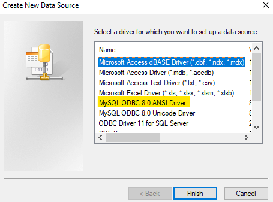

### Configurar conexión ODBC a MySQL en Windows

<strong>Realizado por:</strong> 

1. Buscar en programas de Windows "ODBC". Abrir el programa "Origenes de datos ODBC..." o "ODBC Data Sources" si su sitema se encuentra en inglés.\

2. Ingresar en "Agregar".\

3. Seleccionar "MySQL ODBC 8.0 ANSI Driver".\

4. Ingresar los datos que se muestran a continuación y crear la conexión. Es importante usar "toolbox" como nombre de la conexión. Debido a que de esta forma está definida en la aplicación EEG Analysis Toolbox tanto en standalone, como en el App Designer.\

5. Verifique que el conector "toolbox" se encuentre en la lista de conectores.\

6. Cerrar.
