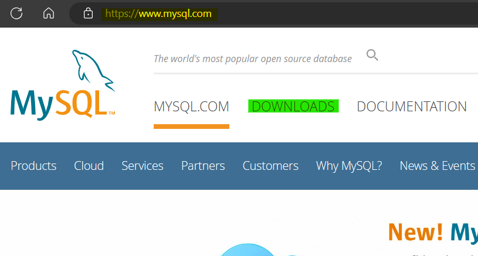
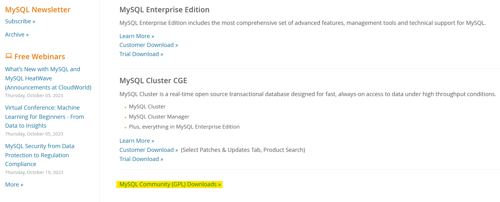
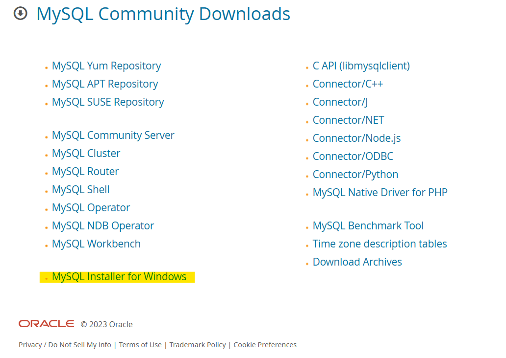
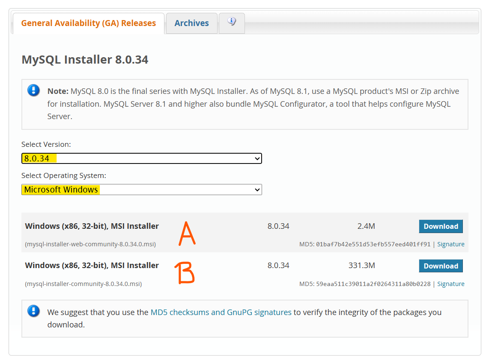
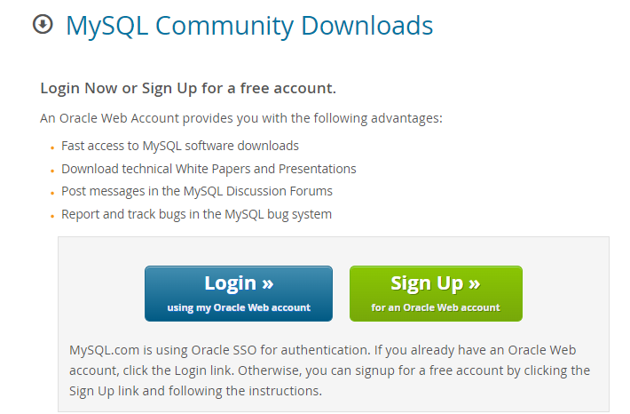
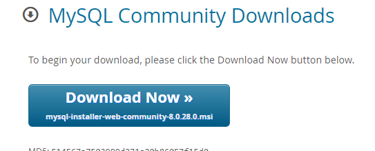

## Descarga de  MySQL

<strong>Realizado por:</strong> 
 

1. Ingresar a <https://www.mysql.com/>
2. Ingresar a Downloads\

3. Ingresar a "MySQL Community (GPL) Downloads"\

4. Ingresar a "MySQL Installer for Windows"\

5. Seleccione la  última version de MySQL 8.0.XX y luego verifique que se encuentre Windows seleccionado. Descargar la opción A si la maquina donde se instalará tiene acceso a internet y B si no tiene acceso a internet.\

6. Si no se cuenta con cuenta de oracle es necesario crear una, de lo contrario simplemente iniciar sesión.\

7. Descargar el instalador.\

