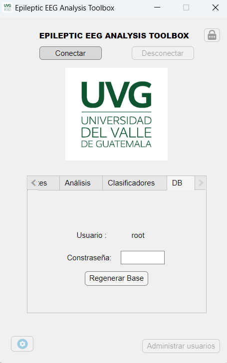

## Instalación del Toolbox

<strong>Realizado por:</strong> 

En la carpeta "\GitHub\Datos-Epilepsia-2021\Jorge-Diego-Manrique\App Designer\EpilepticEEGAnalysisToolbox\for_redistribution" del repositorio de Github se encuentran los executables para Windows del toolbox.

Nota: Si se desea editar o utilizar la app para realizar modificaciónes o pruebas no es necesario seguir estos pasos. Basta con abrir el archivo principal.mlapp ubicado en "\GitHub\Datos-Epilepsia-2021\Jorge-Diego-Manrique\App Designer".

1. Iniciar instalador ubicado en "\GitHub\Datos-Epilepsia-2021\Jorge-Diego-Manrique\App Designer\EpilepticEEGAnalysisToolbox\for_redistribution". Este instaldor instalará el toolbox y el runtime de Matlab requerido para ejecutar la aplicación.\

2. Seguir los pasos del instalador. Seleccionar si se desea crear un acceso directo al toolbox en el escritorio y continuar.\

3. Cuando finalice la instalación cerrar la ventana e iniciar la applicación.\

### Crear modelo relacional en MySQL

<strong>Realizado por:</strong> 

Al contar con la Toolbox y la base de datos instalada, lo único que falta es crear el modelo relaciónal en MySQL. En esta versión de la herramienta, ya no es necesario interactuar con el comando de la base de datos. 
1. Iniciar la aplicación Toolbox.
2. Dirigirse a la pestaña "DB", en la ventana principal. Ninguna otra pestaña tendrá botones activos, únicamente esta.

3. Ingrese la contraseña que colocó al instalar la base de datos y presione "Regenerar Base".
4. Obtendra un mensaje de confirmación en el que debe de presionar "Sí". 
5. Espere a obtener el mensaje de confirmación de que el modelo relacional fue creado.
